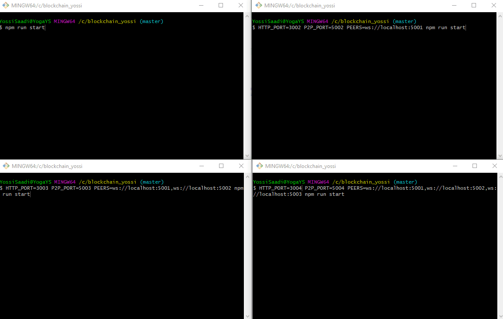
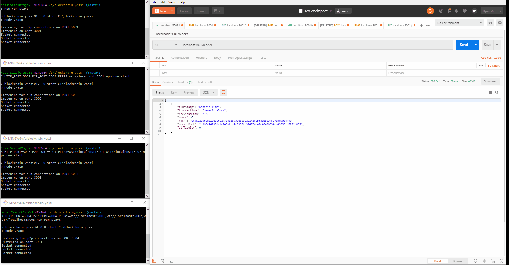

# Blockchain

### Yossi Saadi
### Made as an assignment for course 10354 "Blockchain Vision and Practice", Afeka

## Includes 2 files for the p2p network in '/app':

Index::
Manages the network's p2p connections, API

P2P-server::
Creates new P2P network, responsible for broadcasting the new chain/transaction between all parties

## Includes 6 files for the blockchain app in '/src':

Wallet::
Creates new wallet, adds new transactions by wallet owner and signs them

MemPool::
The blockchain network's pending transactions, waiting to be mined by miners

Transaction::
Creates new transaction

Block::
Creates new block

Blockchain::
Creates the new blockchain

Merkle::
Creates a new Merkle tree for a block

# Installation Instructions
After cloning, enter npm install to install all dependencies

Run in Git-Bash "npm run start" to open 1st node
In order to open 2nd socket, enter "$ HTTP_PORT=3002 P2P_PORT=5002 PEERS=ws://localhost:5001 npm run start" in Git-Bash
To open 3rd node, enter $ HTTP_PORT=3003 P2P_PORT=5003 PEERS=ws://localhost:5001,ws://localhost:5002 npm run start
And so on ...

